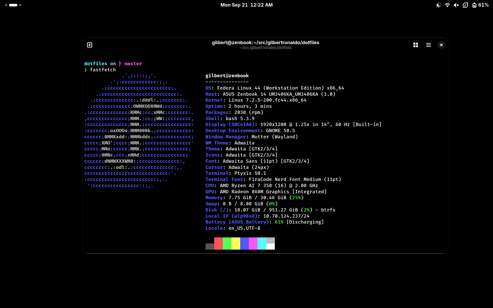
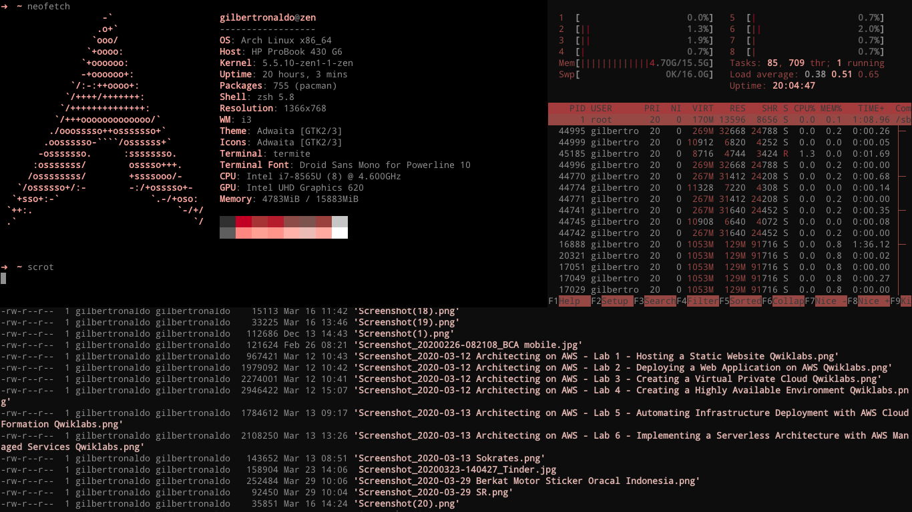
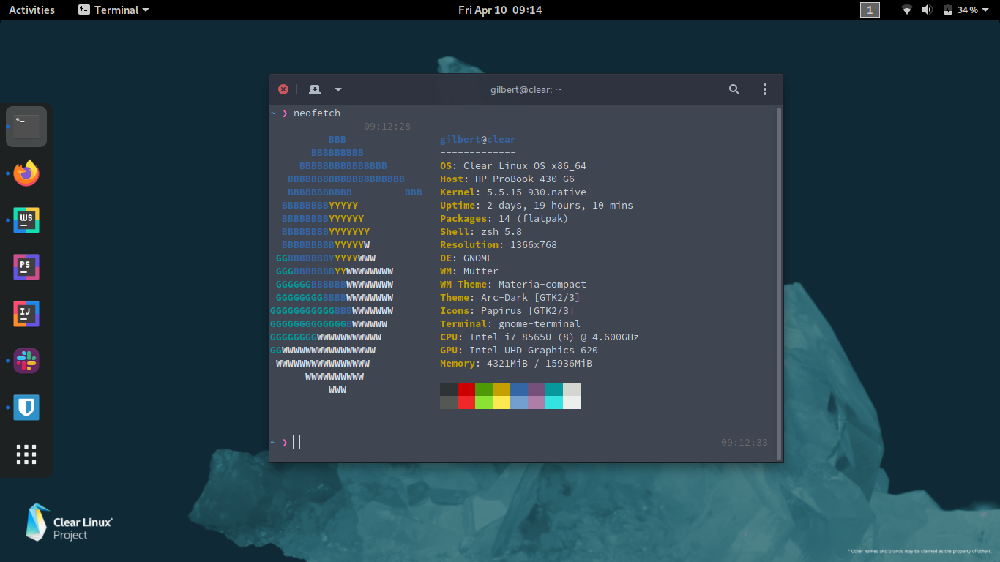

# ~/dotfiles

My battlestation configs, notes, and backups — collected since 2020.

No distro-hopping chaos here. Just two Fedora 44 machines I actually use
every day, tuned to stay fast, quiet, and boring (in a good way).

## The Lineup

| | Laptop | Desktop |
|---|---|---|
| **Machine** | ASUS Zenbook 14 OLED (UM3406KA) | Custom build |
| **CPU** | AMD Ryzen AI 7 350 (8C/16T, up to 5.0 GHz) | Intel Core i9-12900K |
| **GPU** | Radeon 860M (RDNA 3.5 iGPU) + XDNA 2 NPU | NVIDIA GeForce RTX 4090 |
| **RAM** | 32 GB LPDDR5X | 64 GB |
| **Storage** | 1 TB NVMe | — |
| **Display** | 14" OLED WUXGA | — |
| **OS** | Fedora 44 | Fedora 44 |
| **Shell** | BASH + starship + atuin | BASH + starship + atuin |

One OS, two beasts: the Zenbook for anywhere-computing with a 10-hour
battery, the 12900K + 4090 for when subtlety is optional.



## What's inside

```
.
├── assets/    # screenshots & eye candy
├── config/    # the good stuff
│   ├── atuin/     # shell history sync (template only — keys stay private)
│   ├── bash/      # .bashrc, .bash_profile
│   ├── hushmic/   # mic noise suppression (DPDFNet)
│   ├── pipewire/  # Zenbook speaker EQ — ALC294 + CS35L41 smart-amp,
│   │              # tuned by ear, high-passed so tiny speakers don't cry
│   └── starship/  # prompt preset (optional)
├── docs/      # setup notes & important findings
├── legacy/    # where it all started — my 2020 Arch rice
├── scripts/
│   ├── install.sh   # symlink everything to $HOME (auto-backup, idempotent)
│   └── packages.sh  # Fedora package list
└── README.md
```

Highlights:

- **PipeWire speaker EQ** for the Zenbook — conservative bass, clear dialog,
  no hardcoded sink so it survives HDMI/Bluetooth switches.
- **hushmic** with DPDFNet 48 kHz for clean voice without a headset.
- **Gaze** face auth on the laptop (config lives in `/etc/gaze/`, face data
  stays private — not in this repo, obviously).
- **BASH + starship + atuin.** Yes, still BASH. It works, it's everywhere,
  and my muscle memory is non-negotiable.
- **80% charge limit + tuned `balanced-battery`.** My batteries will
  outlive your resolutions.

## Setup notes

```bash
git clone https://github.com/gilbertronaldo/dotfiles.git ~/src/gilbertronaldo/dotfiles
cd ~/src/gilbertronaldo/dotfiles
./scripts/packages.sh   # review first
./scripts/install.sh    # symlinks configs, backs up existing files
systemctl --user restart pipewire
```

Things that live outside this repo (by design):

- Gaze face data + `/etc/gaze/` (private + root-owned)
- Atuin history DB + encryption keys (`~/.local/share/atuin`)
- System knobs: charge limit, tuned profile, firmware updates

## History

- **2020 — the rice era.** Arch Linux with i3 + polybar + neovim + termite +
  compton. Fully preserved under [`legacy/`](legacy/) because deleting
  history is for cowards:

  
  

- **2026 — the grown-up era.** Same taste, less tweaking. Zenbook 14 OLED
  on Fedora for daily driving, 12900K + RTX 4090 desktop for heavy lifting.
  The `config/` + `docs/` setup above is what actually runs today.
